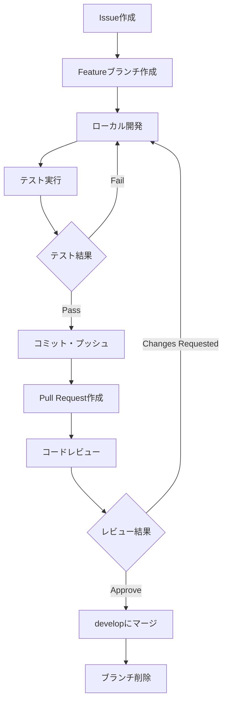

# MindfulReplay 開発ワークフロー

## 📋 概要

効率的で品質の高い開発を実現するための標準化されたワークフローガイドです。

## 🔧 開発環境セットアップ

### 必要な環境
- Node.js 18.0.0+
- npm 9.0.0+
- PostgreSQL 14+
- Git
- VS Code (推奨)

### 初回セットアップ手順

```bash
# 1. リポジトリクローン
git clone <repository-url>
cd mindful-replay

# 2. バックエンド環境構築
cd backend
npm install
cp .env.example .env
# .envファイルを編集して環境変数を設定

# 3. フロントエンド環境構築
cd ../frontend
npm install

# 4. データベースセットアップ
createdb mindful_replay
psql -U postgres -d mindful_replay -f ../database/schema.sql

# 5. 開発サーバー起動テスト
cd ../backend
npm run dev
# 別ターミナルで
cd ../frontend
npm start
```

## 🌿 ブランチ戦略

### Git Flow ベースのブランチモデル

```mermaid
gitgraph
    commit id: "Initial"
    branch develop
    checkout develop
    commit id: "Setup"
    
    branch feature/auth
    checkout feature/auth
    commit id: "Auth API"
    commit id: "Auth Tests"
    
    checkout develop
    merge feature/auth
    
    branch feature/video-management
    checkout feature/video-management
    commit id: "Video CRUD"
    commit id: "YouTube API"
    
    checkout develop
    merge feature/video-management
    
    branch release/v1.0
    checkout release/v1.0
    commit id: "Bug fixes"
    
    checkout main
    merge release/v1.0
    tag: "v1.0.0"
    
    checkout develop
    merge release/v1.0
```

### ブランチ命名規則

| ブランチタイプ | 命名パターン | 例 | 説明 |
|---------------|-------------|-----|------|
| **メイン** | `main` | `main` | 本番リリース用 |
| **開発** | `develop` | `develop` | 統合開発ブランチ |
| **機能開発** | `feature/<機能名>` | `feature/user-auth` | 新機能開発 |
| **バグ修正** | `bugfix/<バグ内容>` | `bugfix/login-error` | バグ修正 |
| **ホットフィックス** | `hotfix/<修正内容>` | `hotfix/security-patch` | 緊急修正 |
| **リリース** | `release/<バージョン>` | `release/v1.0.0` | リリース準備 |

## 📝 コミット規約

### Conventional Commits準拠

```
<type>[optional scope]: <description>

[optional body]

[optional footer(s)]
```

### タイプ一覧

| タイプ | 説明 | 例 |
|-------|------|-----|
| `feat` | 新機能追加 | `feat(auth): add JWT authentication` |
| `fix` | バグ修正 | `fix(api): handle null video response` |
| `docs` | ドキュメント変更 | `docs: update API documentation` |
| `style` | コード整形 | `style: format with prettier` |
| `refactor` | リファクタリング | `refactor(service): extract video validator` |
| `perf` | パフォーマンス改善 | `perf(db): optimize video query` |
| `test` | テスト追加・修正 | `test(auth): add login validation tests` |
| `build` | ビルド関連 | `build: update webpack config` |
| `ci` | CI/CD変更 | `ci: add GitHub Actions workflow` |
| `chore` | その他 | `chore: update dependencies` |

### コミット例

```bash
# 良い例
git commit -m "feat(video): add YouTube video import functionality"
git commit -m "fix(memo): resolve timestamp validation error"
git commit -m "docs(api): update authentication endpoints"

# 悪い例
git commit -m "fix stuff"
git commit -m "update"
git commit -m "WIP"
```

## 🔄 開発フロー

### 機能開発の標準手順



### 詳細手順

#### 1. Issue作成
```markdown
# Issue テンプレート例

## 機能概要
ユーザーがYouTube動画をURLから保存できる機能

## 受け入れ基準
- [ ] YouTube URLの入力フォーム
- [ ] 動画メタデータの自動取得
- [ ] データベースへの保存
- [ ] エラーハンドリング

## 技術仕様
- YouTube Data API v3使用
- バリデーション: Zod
- 応答時間: 3秒以内

## 見積もり
2-3日
```

#### 2. ブランチ作成・開発
```bash
# developから最新を取得
git checkout develop
git pull origin develop

# featureブランチ作成
git checkout -b feature/youtube-video-import

# 開発作業
# ... コード実装 ...

# ローカルテスト
cd backend && npm test
cd frontend && npm test

# lint & typecheck
npm run lint
npm run typecheck
```

#### 3. Pull Request作成
```markdown
# PR テンプレート例

## 概要
YouTube動画のインポート機能を実装

## 変更内容
- YouTube Data API v3統合
- 動画メタデータ取得API実装
- フロントエンドのURL入力フォーム追加
- エラーハンドリング追加

## テスト
- [ ] ユニットテスト追加・実行
- [ ] 統合テスト実行
- [ ] 手動テスト完了

## レビューポイント
- API設計の妥当性
- エラーハンドリングの網羅性
- パフォーマンスへの影響

Closes #123
```

## 🧪 品質管理

### テスト戦略

| テストレベル | 実装場所 | ツール | カバレッジ目標 |
|-------------|---------|--------|---------------|
| **ユニット** | 各コンポーネント・関数 | Jest | 80%+ |
| **統合** | APIエンドポイント | Supertest | 70%+ |
| **E2E** | 主要ユーザーフロー | Detox/Playwright | 主要パス |
| **手動** | 探索的テスト | - | リリース前 |

### テスト実行フロー

```bash
# 開発時の継続実行
npm run test:watch

# プッシュ前の完全テスト
npm run test:coverage

# E2Eテスト (CI環境)
npm run test:e2e
```

### コード品質チェック

#### Pre-commit Hook (Husky)
```json
{
  "husky": {
    "hooks": {
      "pre-commit": "lint-staged",
      "commit-msg": "commitlint -E HUSKY_GIT_PARAMS"
    }
  },
  "lint-staged": {
    "*.{ts,tsx}": [
      "eslint --fix",
      "prettier --write"
    ]
  }
}
```

#### 品質ゲート
- ESLint: エラー0件
- TypeScript: 型エラー0件
- テストカバレッジ: 80%以上
- セキュリティ脆弱性: Critical/High 0件

## 🚀 リリース管理

### リリースサイクル

| フェーズ | 期間 | 作業内容 |
|---------|------|---------|
| **開発** | 2-3週間 | 機能実装・テスト |
| **QA** | 1週間 | 統合テスト・バグ修正 |
| **リリース準備** | 2-3日 | ドキュメント更新・最終確認 |
| **デプロイ** | 1日 | 本番環境デプロイ・監視 |

### リリース手順

```bash
# 1. リリースブランチ作成
git checkout develop
git pull origin develop
git checkout -b release/v1.0.0

# 2. バージョン更新
# package.json version更新
npm run version:bump

# 3. 最終テスト
npm run test:all
npm run build

# 4. リリースノート作成
npm run changelog

# 5. mainにマージ・タグ付け
git checkout main
git merge release/v1.0.0
git tag v1.0.0
git push origin main --tags

# 6. developに統合
git checkout develop
git merge main
git push origin develop

# 7. ブランチクリーンアップ
git branch -d release/v1.0.0
```

## 🐛 バグ管理

### バグ報告テンプレート

```markdown
# バグ報告

## 環境
- OS: iOS 16.0
- Browser: Safari
- App Version: 1.0.0

## 再現手順
1. ログイン画面でメールアドレス入力
2. パスワード入力
3. ログインボタンタップ

## 期待される動作
ホーム画面に遷移する

## 実際の動作
エラーメッセージが表示される

## スクリーンショット
[添付]

## 追加情報
- ネットワーク状態: Wi-Fi
- 他のユーザーでも再現確認済み
```

### バグ優先度・重要度

| 優先度 | 重要度 | 説明 | 対応期間 |
|-------|-------|------|---------|
| P0 | Critical | サービス停止レベル | 即時 |
| P1 | High | 主要機能への影響 | 24時間 |
| P2 | Medium | 一部機能への影響 | 1週間 |
| P3 | Low | 軽微な問題 | 次リリース |

## 📊 メトリクス・監視

### 開発効率メトリクス

| 指標 | 目標値 | 測定方法 |
|------|--------|---------|
| **Lead Time** | 3日以内 | Issue作成〜リリース |
| **Cycle Time** | 1日以内 | 開発開始〜完了 |
| **Deploy Frequency** | 週1回以上 | GitHub Actions |
| **MTTR** | 4時間以内 | 障害検知〜復旧 |
| **Change Failure Rate** | 10%以下 | ロールバック頻度 |

### コード品質メトリクス

```bash
# カバレッジ測定
npm run test:coverage

# 複雑度測定
npm run complexity

# セキュリティ監査
npm audit

# 依存関係チェック
npm outdated
```

## 🔧 開発ツール設定

### VS Code 推奨拡張機能

```json
{
  "recommendations": [
    "ms-vscode.vscode-typescript-next",
    "esbenp.prettier-vscode",
    "dbaeumer.vscode-eslint",
    "bradlc.vscode-tailwindcss",
    "ms-vscode.vscode-json",
    "formulahendry.auto-rename-tag",
    "christian-kohler.path-intellisense"
  ]
}
```

### デバッグ設定

```json
{
  "version": "0.2.0",
  "configurations": [
    {
      "name": "Debug Backend",
      "type": "node",
      "request": "launch",
      "program": "${workspaceFolder}/backend/src/server.ts",
      "env": {
        "NODE_ENV": "development"
      },
      "runtimeArgs": ["-r", "tsx/cjs"]
    }
  ]
}
```

## 🚨 緊急時対応

### インシデント対応フロー

1. **検知** (0-5分)
   - アラート確認
   - 影響範囲特定

2. **対応** (5-30分)
   - 緊急修正 or ロールバック
   - ユーザー向け告知

3. **復旧** (30分-2時間)
   - 根本原因調査
   - 修正版デプロイ

4. **事後処理** (24-48時間)
   - ポストモーテム実施
   - 再発防止策策定

### ホットフィックス手順

```bash
# 1. 緊急ブランチ作成
git checkout main
git checkout -b hotfix/critical-security-fix

# 2. 修正実装・テスト
# ... 修正作業 ...
npm run test

# 3. 緊急リリース
git checkout main
git merge hotfix/critical-security-fix
git tag v1.0.1
git push origin main --tags

# 4. 修正をdevelopにも適用
git checkout develop
git merge main
```

---

*このワークフローは開発チームの成長に応じて継続的に改善されます*