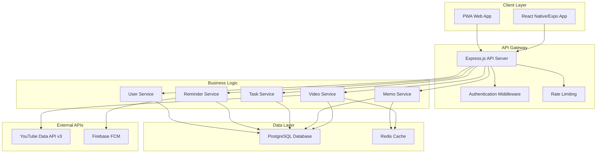
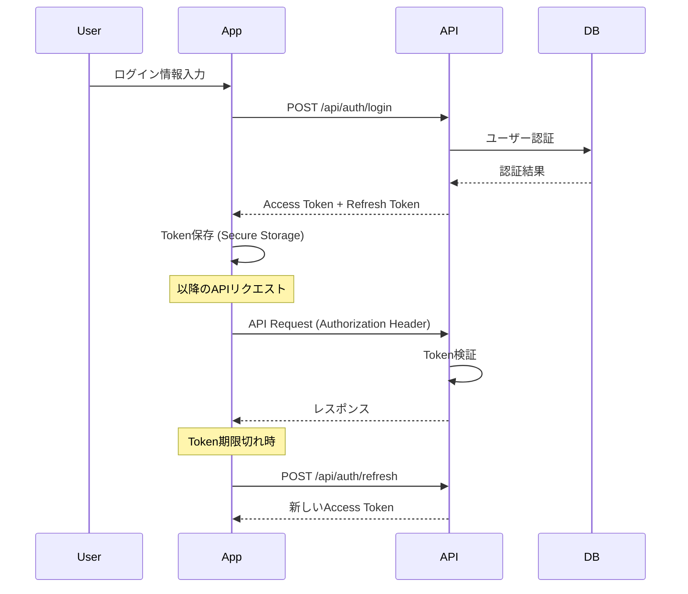
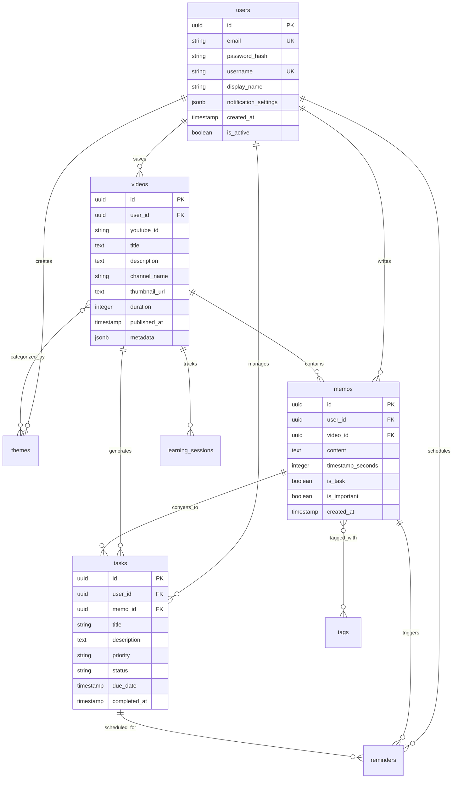
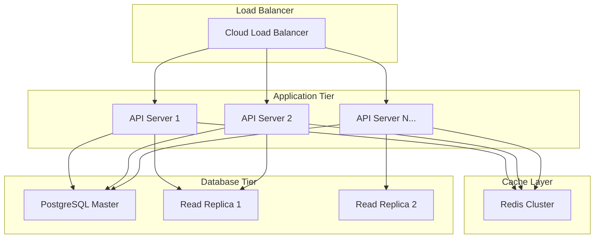

# MindfulReplay 技術アーキテクチャ

## 📋 概要

MindfulReplayは、YouTube動画を活用した学習管理プラットフォームとして設計されたモバイルWebアプリケーションです。

## 🏗️ システムアーキテクチャ

## 🛠️ 技術スタック詳細

### フロントエンド技術

| 技術 | バージョン | 用途 | 選定理由 |
|------|---------|------|---------|
| **React Native** | 0.79.6 | モバイルアプリ開発 | クロスプラットフォーム対応、ネイティブパフォーマンス |
| **Expo** | ~53.0.22 | 開発・ビルド環境 | 開発効率向上、OTA更新対応 |
| **TypeScript** | ~5.8.3 | 型安全性 | 開発時のエラー削減、保守性向上 |
| **React Navigation** | ^6.1.9 | ルーティング | RN標準、豊富な機能 |
| **React Query** | ^5.13.4 | データフェッチング | キャッシュ、同期処理の最適化 |
| **Zustand** | ^4.4.7 | 状態管理 | シンプル、TypeScript親和性 |
| **React Hook Form** | ^7.48.2 | フォーム管理 | パフォーマンス、バリデーション |

### バックエンド技術

| 技術 | バージョン | 用途 | 選定理由 |
|------|---------|------|---------|
| **Node.js** | 18+ | ランタイム | JavaScript統一、非同期I/O |
| **Express** | ^4.18.2 | Webフレームワーク | 軽量、豊富なミドルウェア |
| **TypeScript** | ^5.3.3 | 型安全性 | フロントエンドとの一貫性 |
| **Knex.js** | ^3.1.0 | SQLクエリビルダー | マイグレーション対応、型安全性 |
| **PostgreSQL** | 14+ | メインデータベース | ACID特性、JSON対応、拡張性 |
| **Redis** | 7+ | キャッシュ・セッション | 高速アクセス、揮発性データ |
| **JWT** | ^9.0.2 | 認証 | ステートレス、スケーラブル |
| **Winston** | ^3.11.0 | ログ管理 | 構造化ログ、複数出力対応 |

### インフラストラクチャ

| サービス | 用途 | 理由 |
|---------|------|------|
| **Google Cloud Platform** | クラウドプラットフォーム | YouTube API統合、Firebase連携 |
| **Cloud Run** | アプリケーション実行環境 | サーバーレス、自動スケーリング |
| **Cloud SQL** | PostgreSQL管理 | マネージドサービス、高可用性 |
| **Cloud Storage** | 静的ファイル配信 | CDN、画像・動画キャッシュ |
| **Firebase FCM** | プッシュ通知 | モバイル通知配信 |

## 🔐 セキュリティアーキテクチャ

### 認証・認可フロー

### セキュリティ対策

| レイヤー | 対策 | 実装方法 |
|---------|------|---------|
| **ネットワーク** | HTTPS強制 | Cloud Run設定 |
| **API** | レート制限 | express-rate-limit |
| **認証** | JWT + Refresh Token | jsonwebtoken |
| **認可** | Role-based Access Control | ミドルウェア実装 |
| **入力検証** | スキーマバリデーション | Zod |
| **データベース** | SQLインジェクション対策 | Knex.jsパラメータ化クエリ |
| **CORS** | オリジン制限 | cors middleware |
| **ヘッダー** | セキュリティヘッダー | helmet |

## 📊 データアーキテクチャ

### データベース設計

#### 主要エンティティ関係図

### データ永続化戦略

| データタイプ | 保存場所 | TTL | 理由 |
|-------------|---------|-----|------|
| **ユーザーデータ** | PostgreSQL | 永続 | トランザクション整合性 |
| **動画メタデータ** | PostgreSQL | 永続 | 関係性管理 |
| **メモ・タスク** | PostgreSQL | 永続 | CRUD頻度高、検索要件 |
| **セッション情報** | Redis | 30日 | 高速アクセス要件 |
| **APIレスポンス** | Redis | 1時間 | パフォーマンス最適化 |
| **YouTube API結果** | Redis | 24時間 | API制限回避 |

## 🚀 パフォーマンスアーキテクチャ

### フロントエンド最適化

| 手法 | 実装 | 効果 |
|------|------|------|
| **コード分割** | React.lazy, 画面別バンドル | 初期ロード時間短縮 |
| **画像最適化** | WebP対応, 遅延読み込み | データ転送量削減 |
| **キャッシュ戦略** | React Query, SWR | API呼び出し削減 |
| **メモ化** | React.memo, useMemo | 不要な再レンダリング抑制 |
| **Virtual Scrolling** | 長いリスト最適化 | メモリ使用量削減 |

### バックエンド最適化

| 手法 | 実装 | 効果 |
|------|------|------|
| **データベース最適化** | インデックス、クエリ最適化 | レスポンス時間改善 |
| **Redis キャッシング** | 頻繁アクセスデータ | DB負荷軽減 |
| **コネクションプーリング** | Knex.jsプール設定 | DB接続効率化 |
| **API レスポンス圧縮** | gzip middleware | 転送量削減 |
| **非同期処理** | Node.js非同期I/O活用 | スループット向上 |

## 🔄 拡張性アーキテクチャ

### 水平スケーリング対応

### マイクロサービス移行計画

| フェーズ | 分離するサービス | 理由 |
|---------|----------------|------|
| **Phase 1** | 認証サービス | セキュリティ分離、再利用性 |
| **Phase 2** | 通知サービス | バッチ処理、独立スケーリング |
| **Phase 3** | 分析サービス | データ処理量、ML統合 |
| **Phase 4** | 検索サービス | Elasticsearch統合、全文検索 |

## 📊 監視・ログ戦略

### ログレベル設計

| レベル | 用途 | 出力先 | 保存期間 |
|--------|------|--------|---------|
| **ERROR** | エラー、例外 | File + Cloud Logging | 90日 |
| **WARN** | 警告、パフォーマンス劣化 | File + Cloud Logging | 30日 |
| **INFO** | ビジネスイベント | File + Cloud Logging | 7日 |
| **DEBUG** | 開発デバッグ情報 | File (dev only) | 1日 |

### メトリクス監視

| カテゴリ | メトリクス | 閾値 | アクション |
|---------|----------|------|---------|
| **可用性** | Uptime | 99.9% | アラート + 自動復旧 |
| **パフォーマンス** | Response Time | P95 < 200ms | パフォーマンス調査 |
| **エラー率** | 4xx/5xx Rate | < 0.1% | エラー分析 |
| **リソース** | CPU/Memory | < 80% | スケーリング |

## 🔮 将来技術検討

### Phase 2以降での検討技術

| 技術 | 用途 | 検討理由 | タイミング |
|------|------|---------|---------|
| **GraphQL** | API統合 | フロントエンド最適化 | MVP後 |
| **WebSocket** | リアルタイム同期 | 学習セッション共有 | Phase 2 |
| **Elasticsearch** | 全文検索 | 検索精度向上 | Phase 2 |
| **Machine Learning** | 推薦システム | パーソナライゼーション | Phase 3 |
| **Event Sourcing** | データ永続化 | 学習履歴分析 | Phase 3 |

---

*このドキュメントは技術選定と実装に応じて継続的に更新されます*