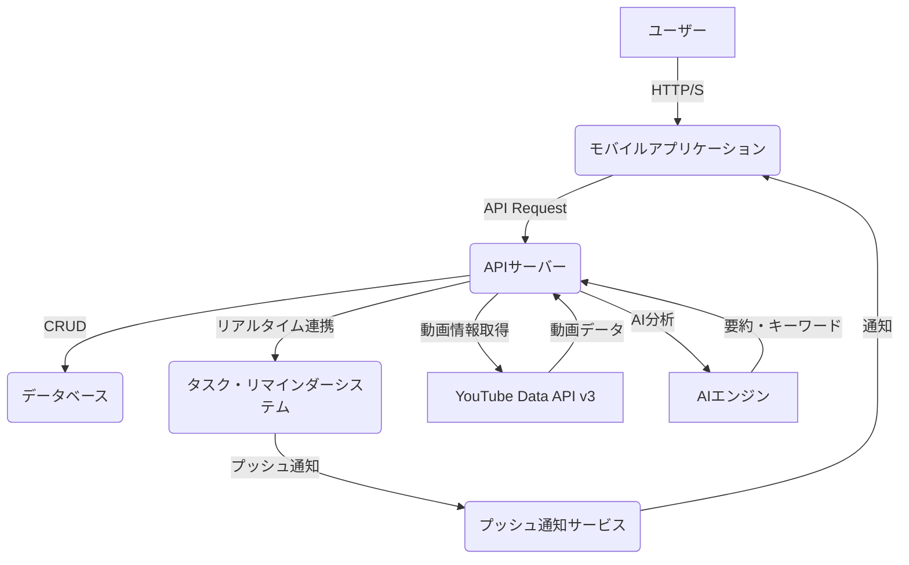

### 1\. システム全体構成図 (最大ボリューム版)

MVPの構成に加え、ユーザーの学習行動を促すための**タスク管理システム**、**テーマ別管理システム**、そして将来的には**AI連携**を視野に入れた拡張性の高いアーキテクチャを提案します。



-----

### 2\. 主要機能とAPI設計 (最大ボリューム版)

MVPのAPIエンドポイントをベースに、さらに詳細な機能とAPIを定義します。

#### ユーザー認証・管理

  * **アカウント登録**: `POST /auth/register`
  * **ログイン**: `POST /auth/login`
  * **ユーザープロファイル取得/更新**: `GET /users/me`, `PUT /users/me`

#### 動画管理

  * **動画追加**: `POST /videos`
      * ユーザーがURLを貼り付けると、バックエンドがYouTube APIから動画情報（タイトル、サムネイル、説明など）を取得し、データベースに保存します。
  * **動画リスト取得**: `GET /videos?theme_id=...&sort=...`
      * テーマやタグ、最終視聴日などでフィルタリング・ソートできるパラメータを追加し、ユーザーの検索ニーズに応えます。

#### メモ・タスク管理

  * **メモ追加**: `POST /videos/:videoId/memos`
      * タイムスタンプ、タグに加え、メモが\*\*「行動タスク」\*\*かどうかのフラグを持たせます。
  * **タスクリスト取得**: `GET /tasks?status=...`
      * **ケンタのニーズ**に応えるため、メモの中でも「タスク」として登録されたものだけを抽出し、進捗ステータス（未完了、完了など）で管理します。
  * **タスクの進捗更新**: `PUT /tasks/:taskId/status`
      * タスクが完了した際にステータスを更新し、達成感を可視化します。

#### テーマ管理

  * **テーマ作成**: `POST /themes`
      * **ユミのニーズ**に応えるため、複数の動画やメモをまとめる「テーマ」を作成するAPI。
  * **テーマに動画を追加**: `POST /themes/:themeId/videos`
  * **テーマの詳細取得**: `GET /themes/:themeId`
      * テーマに紐づく動画、メモ、タスクを一覧で取得します。

#### リマインダー管理

  * **リマインダー設定**: `POST /reminders`
      * **リマインドタイミング**として「日時指定」に加え、「視聴日からの経過日数」（例：1週間後）や「テーマ別の定期リマインド」など、より柔軟な設定を可能にします。

#### 検索機能

  * **統合検索**: `GET /search?q=キーワード`
      * **マサオのニーズ**に応え、メモ、動画、タグ、テーマなど、すべてのデータを横断的に検索できます。

-----

### 3\. データベーススキーマ設計 (最大ボリューム版)

より複雑なデータ構造に対応するため、リレーショナルデータベース（PostgreSQL）を前提に、テーブル定義を詳細化します。

```sql
-- ユーザーテーブル
CREATE TABLE users (
    id UUID PRIMARY KEY,
    email VARCHAR(255) UNIQUE NOT NULL,
    password_hash VARCHAR(255) NOT NULL,
    created_at TIMESTAMP WITH TIME ZONE DEFAULT CURRENT_TIMESTAMP
);

-- 動画テーブル
CREATE TABLE videos (
    id UUID PRIMARY KEY,
    user_id UUID REFERENCES users(id),
    youtube_id VARCHAR(50) UNIQUE NOT NULL,
    title VARCHAR(255),
    thumbnail_url VARCHAR(255),
    description TEXT, -- 動画の説明文も保存
    created_at TIMESTAMP WITH TIME ZONE DEFAULT CURRENT_TIMESTAMP
);

-- メモテーブル
CREATE TABLE memos (
    id UUID PRIMARY KEY,
    video_id UUID REFERENCES videos(id),
    content TEXT NOT NULL,
    timestamp_sec INTEGER,
    is_task BOOLEAN DEFAULT FALSE, -- 行動タスクかどうかのフラグ
    created_at TIMESTAMP WITH TIME ZONE DEFAULT CURRENT_TIMESTAMP
);

-- タグテーブル（多対多）
CREATE TABLE tags (
    id UUID PRIMARY KEY,
    name VARCHAR(50) UNIQUE NOT NULL
);

CREATE TABLE memo_tags (
    memo_id UUID REFERENCES memos(id),
    tag_id UUID REFERENCES tags(id),
    PRIMARY KEY (memo_id, tag_id)
);

-- テーマテーブル
CREATE TABLE themes (
    id UUID PRIMARY KEY,
    user_id UUID REFERENCES users(id),
    name VARCHAR(255) NOT NULL,
    description TEXT,
    created_at TIMESTAMP WITH TIME ZONE DEFAULT CURRENT_TIMESTAMP
);

CREATE TABLE theme_videos (
    theme_id UUID REFERENCES themes(id),
    video_id UUID REFERENCES videos(id),
    PRIMARY KEY (theme_id, video_id)
);

-- タスクテーブル（メモから独立）
CREATE TABLE tasks (
    id UUID PRIMARY KEY,
    memo_id UUID REFERENCES memos(id),
    user_id UUID REFERENCES users(id),
    status VARCHAR(50) NOT NULL DEFAULT 'uncompleted', -- 'uncompleted', 'completed'
    due_date TIMESTAMP WITH TIME ZONE,
    created_at TIMESTAMP WITH TIME ZONE DEFAULT CURRENT_TIMESTAMP
);

-- リマインダーテーブル
CREATE TABLE reminders (
    id UUID PRIMARY KEY,
    task_id UUID REFERENCES tasks(id), -- タスクと紐づける
    remind_at TIMESTAMP WITH TIME ZONE NOT NULL,
    status VARCHAR(50) NOT NULL DEFAULT 'pending',
    created_at TIMESTAMP WITH TIME ZONE DEFAULT CURRENT_TIMESTAMP
);
```

-----

### 4\. フロントエンド（モバイルアプリ）設計 (最大ボリューム版)

UI/UXをさらに詳細化し、各ペルソナのニーズに合わせた専用画面を設計します。

  * **ホーム画面**: ユーザーの最近の活動（追加した動画、メモ）や、設定したタスクの進捗状況をグラフで表示。**ユミのモチベーション維持**に寄与します。
  * **動画一覧画面**: 動画をテーマ別やタグでフィルタリングできるUIを実装。**ユミやマサオの知識整理**を助けます。
  * **動画詳細画面**: 動画再生プレイヤーの下にメモ入力欄とタイムスタンプボタンを配置。さらに「タスクとして追加」ボタンを設けます。
  * **タスク管理画面**: リスト形式でタスクを表示し、完了ボタンでステータスを簡単に変更できる。**ケンタの行動促進**に特化した画面です。
  * **テーマ詳細画面**: 選択したテーマに紐づく動画、メモ、タスクを一覧で表示。学習の進捗を視覚的に把握できます。
  * **設定画面**: リマインダーの通知設定や、信頼できるYouTubeチャンネルの登録などを管理。

この最大ボリュームの設計は、すべてのペルソナのニーズを深く満たし、**偶然の再視聴を「学び」と「行動」の必然的なサイクルに変える**という当初の目標を、より高いレベルで実現するためのものです。